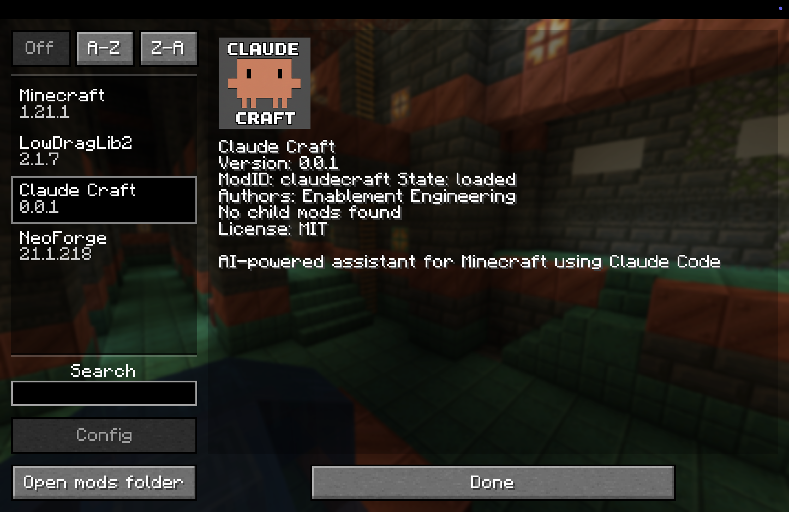
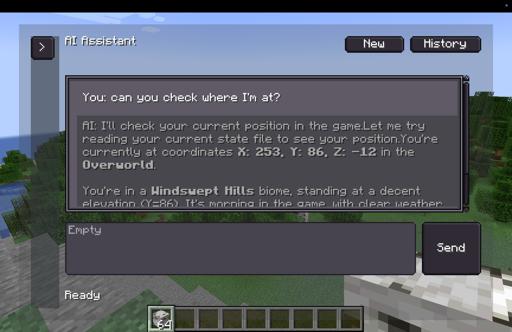
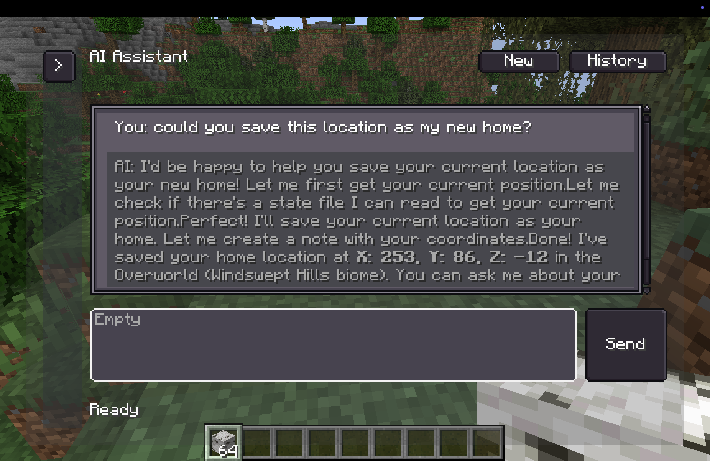
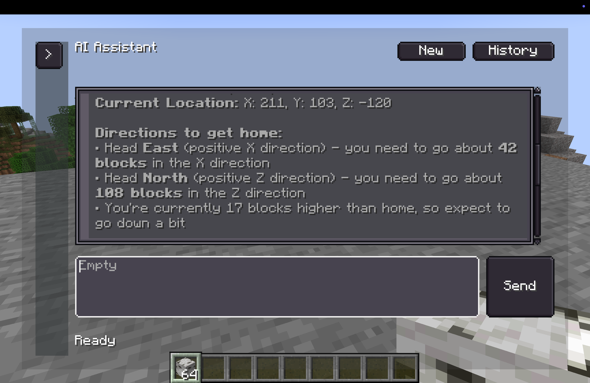

# Claude Craft

A NeoForge mod that integrates Claude Code directly into Minecraft. Chat with an AI assistant that can see your game state, save notes, and help with your adventures.



## Screenshots

| | |
|---|---|
|  |  |
| *Ask Claude about your position* | *Save locations to notes* |
|  |  |
| *Get directions back home* | *Save info to the scratch pad* |

## Features

- **In-game AI Chat** - Talk to Claude with streaming responses
- **Game State Awareness** - Claude can see your coordinates, inventory, and surroundings
- **Scratch Pad** - Shared notepad between you and Claude
- **Pinnable Overlays** - Dock chat and notes to your HUD
- **Conversation History** - Resume previous conversations
- **Per-player Files** - Each player has their own private AI context

## Requirements

- Java 21
- [Claude Code CLI](https://claude.ai/code) installed and authenticated
- [LDLib2](https://modrinth.com/mod/ldlib) (UI framework dependency)

## Quick Start

```bash
# Build the mod
./gradlew build

# Or run directly in dev environment
./gradlew runClient
```

Install `build/libs/claudecraft-*.jar` and LDLib2 into your NeoForge 1.21.1 mods folder.

## Keybinds

| Key | Action |
|-----|--------|
| `\` | Open AI Chat |
| `'` | Open Scratch Pad |
| `-` | Toggle Chat overlay |
| `=` | Toggle Scratch Pad overlay |
| `0` | Hide all overlays |

## Architecture

```
Minecraft Server
├── Mod (NeoForge + LDLib2)
│   ├── Spawns Claude Code subprocess per chat
│   ├── Streams responses to client
│   └── Updates game state files
└── plugins/claude-craft/
    ├── .claude/           # Skills and hooks
    └── players/{uuid}/    # Per-player files
        ├── scratch.md     # Shared notepad
        ├── state.json     # Game state
        └── notes/         # Saved notes
```

## Security

- Claude can only write `.md` and `.json` files
- Non-OP players can only write to their own directory
- Bash commands restricted to approved scripts in `bin/`

## License

MIT
